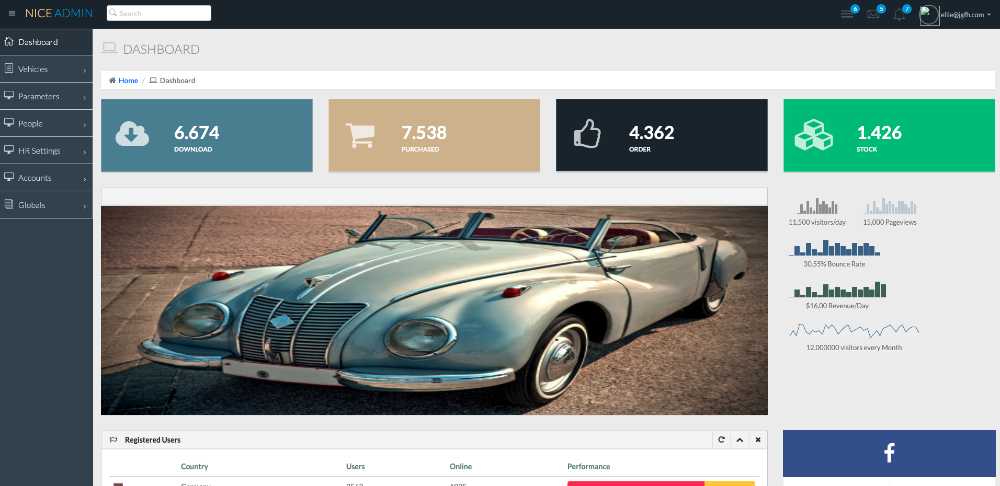

# SpringBoot-MySQL-Car-Management-System
Complete Application in Spring Boot
Technologies used:
Java, JavaScript,  Spring Security – User Login, Spring Data Jpa, MySQL Database, Thymeleaf Template Engine, HTML and Basic CSS, Bootstrap, and JQuery

_______________________________________________________________________________________

_______________________________________________________________________________________

